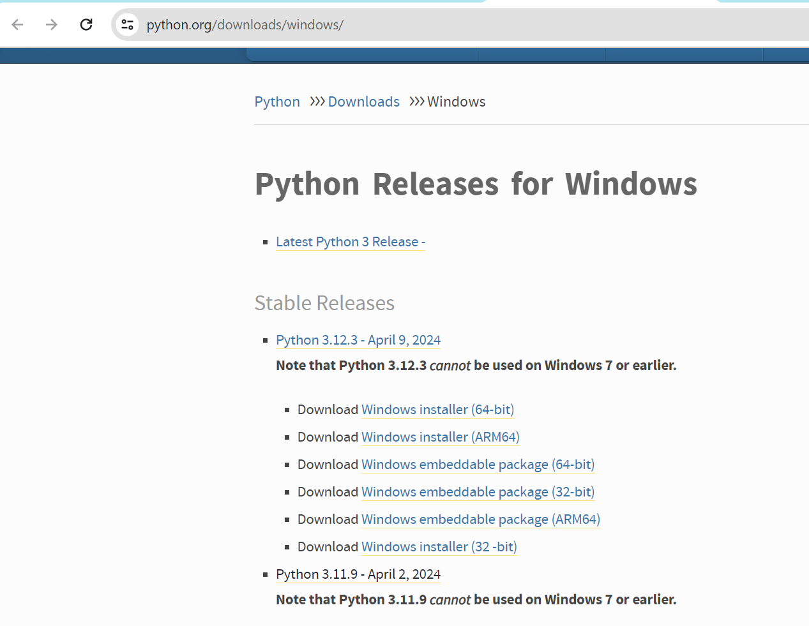
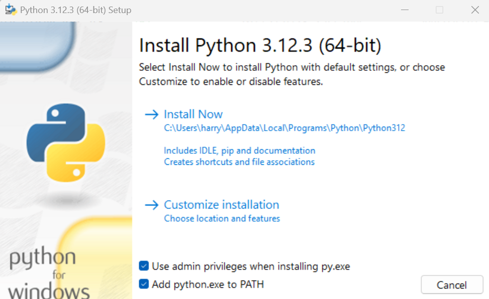
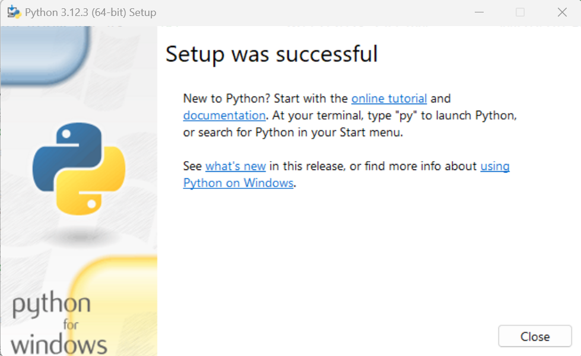
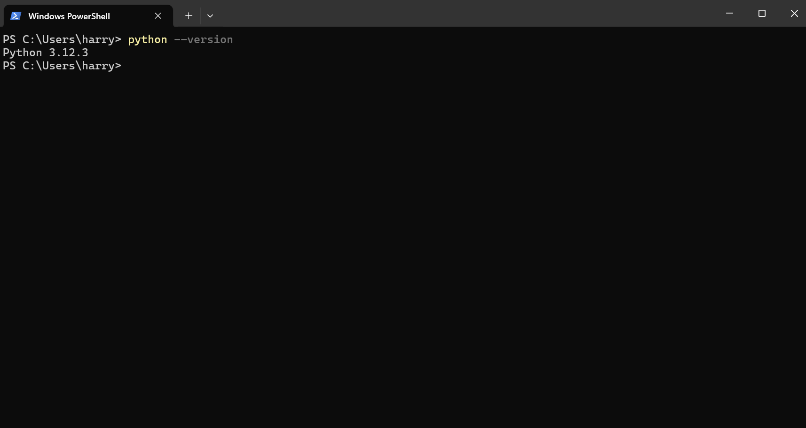

## Installing Python on Windows

- Go to python website and download the latest python version 64 bit installer 

- Run the executable that you just downloaded - i.e. `python-3.12.3-amd64.exe`. Remember to tick on the option `Add python.exe to PATH`. 

- Click on `Install Now` and keep clicking `Next` to finish the installation. Eventually, you should see a confirmation that `Setup was successful`: 

- Close the setup window. Python should now be installed on your system.

- To confirm that Python has been added to your computer, you can open a Powershell terminal (Go to Start and search for Windows Powershell). If you use `vscode`, you can go to `Terminal > New Terminal` or press `Ctrl + Shift + ~` to open a terminal. 

- In the terminal, type `python --version`. You should see that the output matches the version of python that you just installed - i.e. `Python 3.12.3`.

